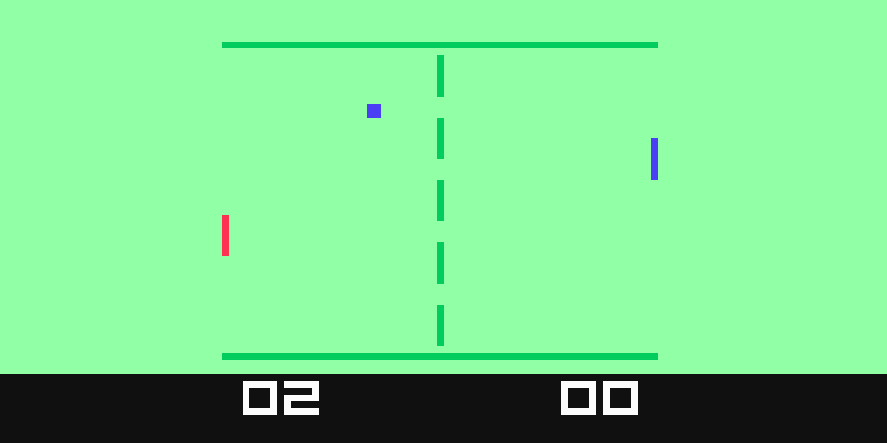

# yuki-js

A tiny subset of javascript allowing only numbers, arrays of numbers,
subroutines (not functions), configurable constraints and externally provided
functions.

It is intended to be used by projects that want to allow limited user scripting
with various constraints around memory and etc, eg for a
[fantasy console](https://itch.io/blog/5733/your-field-guide-to-fantasy-consoles)
project

**This is an alpha release!**

`npm install yuki-js`

## example

In the examples folder you will find Pong implemented in yuki-js, with
constraints set up to mirror the
[Fairchild Channel F](https://en.wikipedia.org/wiki/Fairchild_Channel_F):



## compiling yuki-js programs

```js
const { compile } = require( 'yuki-js' )

// requires an esprima-style AST - you can create one from source very easily
// using the esprima package
const yukiAst = {
  type: 'Program',
  body: [
    // statements here
  ],
  sourceType: 'module'
}

// main is an esprima-style AST - you can turn it back into source code using
// the escodegen package
const { main } = compile( yukiAst )
```

### compile options

Pass an object as the second argument

```ts
interface CompileOptions {
  memorySize: number
  maxProgramSize: number
  instructionSize: number
  lib: Program
  requiredSubroutines: string[]
}
```

`memorySize` is the maximum size in bytes that the user-declared variables
can use - any remaining memory is used for the call stack. Each function call
when entered uses the amount of memory in bytes that would be required to
address the program (see `maxProgramSize` below), and frees that memory when
exited

`maxProgramSize` is the maximum size in bytes that the program can take up -
the program size is determined by walking the AST and counting each non-literal
node as `instructionSize` bytes, and each numeric literal as the smallest number
of bits required to hold that value

`instructionSize` the size in bytes that each instruction uses - used by
`maxProgramSize`, see above

`lib` is an esprima `Program` containing any external functions that the user
can call from their program - only top level functions in this program will
be available, not any of the variables etc.

`requiredSubroutines` is a list of the function names that the user program is
required to implement

The default options are:
```ts
export const defaultCompileOptions: CompileOptions = {
  memorySize: 1024,
  maxProgramSize: 1024,
  instructionSize: 1,
  lib: {
    type: 'Program',
    body: [],
    sourceType: 'script'
  },
  requiredSubroutines: []
}
```

## writing yuki-js programs

Programs are normal JavaScript, but all `const` and `let` statements must
appear at the beginning of the program - `var` is not supported

Only boolean literals, number literals and array literals may be assigned
to a `const`

`let` statements declare the type, numbers are initialized to `0` and arrays
are initialized to a fixed-length array of the specified length

Because this is a memory constrained system, a wider range of int and uint types
than usual are provided for ease of use.

You can specify any number of bits from 2-32 for a number:

```js
let a = Uint5
let b = Int23
```

Numbers are initialized to `0`

An array is declared by providing a single argument for its length:

```js
let values = Uint17( 10 )
```

Arrays are filled with `0`

All numeric and logical operators are supported

Control flow consists of `break`, `continue` and `if...else` statements

Functions are implemented as subroutines - they cannot be nested, take
parameters, contain local variables or return anything, although the `return`
statement with no argument is allowed anywhere in the function body.

Iteration consists of `do...while`, `for` and `while` statements

When assigning to a numeric variable or array index, the value provided is
coerced to an acceptable value using rules similar to `C`, eg out of range
numbers wrap around, signed and unsigned are converted as though they had the
same bit pattern etc

```js
const a = 1
const b = 2
const c = [ 1, 2, 3 ]
const d = false
const e = [ true, false, true ]

let f = Uint8
let g = Int16
let h = Int16
let i = Int16( 3 )
let j = Bool
let length = Int16
let left = Int8
let right = Int8
let sum = Int8

f = 10
g = 5
h = f + g

i[ 0 ] = f
i[ 1 ] = g
i[ 2 ] = h

j = d && e[ 0 ]

/*
  `size` is built in - member expressions other than array indexers are not
  allowed, so you cannot do `g.length`
*/
//
length = size( g )

function add(){
  sum = left + right
}

add()

// required by options
function tick(){
  f++
}
```

## design and features

Supported JavaScript features were heavily restricted for ease of implementation

I plan to extend the capabilities in future - some possible options:

- variables declared anywhere
  - assert memory constraints at runtime instead of compile time to support this
  - this also means you will be able to use the `delete` operator to free memory
- strings
  - just arrays of bytes under the hood
  - therefore no `+` concatentation etc
- floats
- simple (eg JSON-style) objects
  - will just be syntactical sugar
- proper functions, not just subroutines
  - take parameters
  - return any allowed type
  - have scope
  - a new type allowing `let` declaration to support first class functions
 - source maps

## license

MIT License

Copyright (c) 2019 Nik Coughlin

Permission is hereby granted, free of charge, to any person obtaining a copy
of this software and associated documentation files (the "Software"), to deal
in the Software without restriction, including without limitation the rights
to use, copy, modify, merge, publish, distribute, sublicense, and/or sell
copies of the Software, and to permit persons to whom the Software is
furnished to do so, subject to the following conditions:

The above copyright notice and this permission notice shall be included in all
copies or substantial portions of the Software.

THE SOFTWARE IS PROVIDED "AS IS", WITHOUT WARRANTY OF ANY KIND, EXPRESS OR
IMPLIED, INCLUDING BUT NOT LIMITED TO THE WARRANTIES OF MERCHANTABILITY,
FITNESS FOR A PARTICULAR PURPOSE AND NONINFRINGEMENT. IN NO EVENT SHALL THE
AUTHORS OR COPYRIGHT HOLDERS BE LIABLE FOR ANY CLAIM, DAMAGES OR OTHER
LIABILITY, WHETHER IN AN ACTION OF CONTRACT, TORT OR OTHERWISE, ARISING FROM,
OUT OF OR IN CONNECTION WITH THE SOFTWARE OR THE USE OR OTHER DEALINGS IN THE
SOFTWARE.
